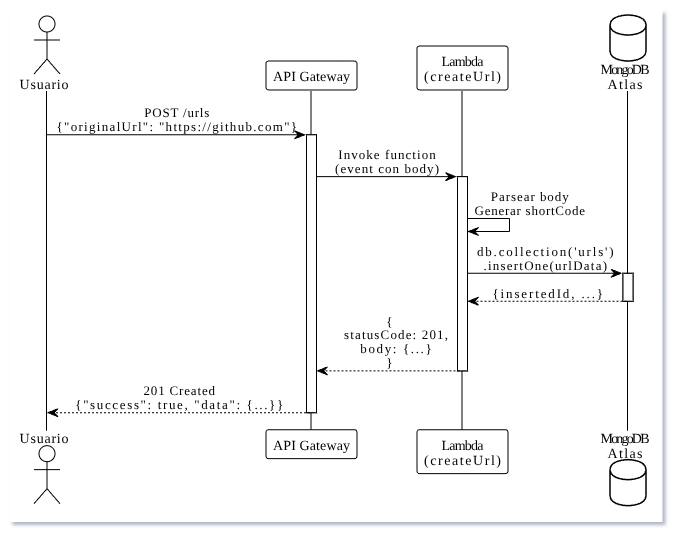
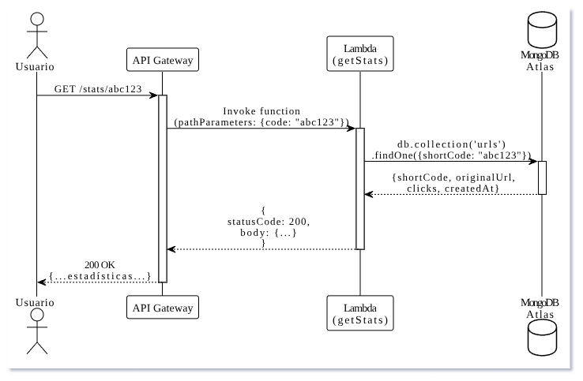
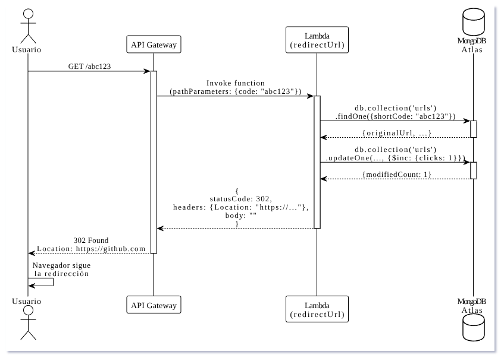
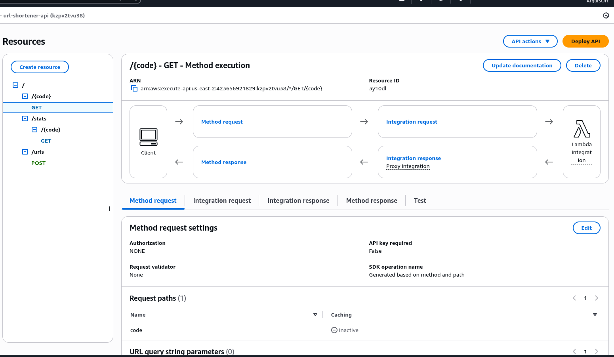
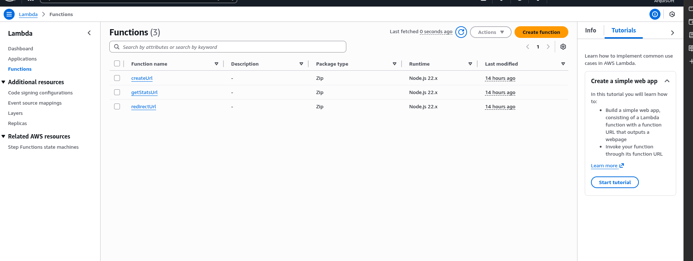
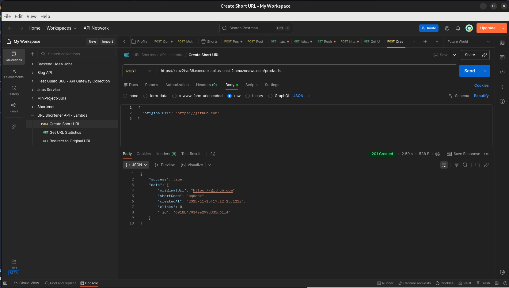

# Punto 3: Servicios Web y APIs - Arquitectura Serverless

## 📋 Descripción

Reimplementación del backend de acortador de URLs usando arquitectura serverless con AWS Lambda y API Gateway. Demuestra el modelo de ejecución sin servidor (serverless) donde el código se ejecuta bajo demanda sin gestionar infraestructura.

## 🏗️ Arquitectura Serverless

### Componentes

- **API Gateway:** Puerta de entrada HTTP, maneja routing y autenticación
- **AWS Lambda:** Funciones que ejecutan la lógica de negocio
- **MongoDB Atlas:** Base de datos compartida con implementaciones anteriores

### Características

- **Sin servidor:** No hay EC2 que mantener
- **Escalado automático:** Lambda escala según demanda (0 a miles de instancias)
- **Pago por uso:** Solo pagas por ejecuciones reales
- **Alta disponibilidad:** AWS gestiona redundancia y failover


### Diagramas de Secuencia

#### Create Url


#### Get Stats


#### Redirect Url


## 🛠️ Tecnologías

- **AWS Lambdas** (Node.js)
- **AWS API Gateway** (REST API)
- **MongoDB Atlas** (base de datos)
- **Node.js** con driver nativo de MongoDB

## 📡 API Endpoints

### Base URL
```
https://kzpv2tvu38.execute-api.us-east-2.amazonaws.com/prod
```

### Endpoints Implementados

#### POST /urls
Crear URL acortada

**Request:**
```json
{
  "originalUrl": "https://ejemplo.com"
}
```

**Response:**
```json
{
  "success": true,
  "data": {
    "originalUrl": "https://ejemplo.com",
    "shortCode": "abc123",
    "createdAt": "2025-11-15T...",
    "clicks": 0,
    "_id": "..."
  }
}
```

**Lambda:** `createUrl`

---

#### GET /stats/{code}
Obtener estadísticas de una URL

**Response:**
```json
{
  "shortCode": "abc123",
  "originalUrl": "https://ejemplo.com",
  "clicks": 42,
  "createdAt": "2025-11-15T..."
}
```

**Lambda:** `getStats`

---

#### GET /{code}
Redirigir a URL original (incrementa clicks)

**Response:**
```
HTTP 302 Redirect
Location: https://ejemplo.com
```

**Lambda:** `redirectUrl`

## 🚀 Despliegue

### Lambda Functions

Cada función tiene su carpeta con:
```
lambda-functions/
├── createUrl/
│   ├── index.js
│   ├── package.json
│   └── node_modules/
├── getStats/
│   └── ...
└── redirectUrl/
    └── ...
```

### Proceso de Deploy

**1. Instalar dependencias:**
```bash
cd /createUrl
npm install
```

**2. Crear ZIP:**
```bash
zip -r createUrl.zip .
```

**3. Subir a Lambda:**
- Usando AWS Interfaz

**4. Configurar API Gateway:**
- Crear recursos y métodos
- Integrar con Lambdas correspondientes
- Habilitar Lambda Proxy Integration
- Deploy a stage `prod`


## 📈 Ventajas de Serverless

### ✅ Escalabilidad automática
- Lambda escala automáticamente de 0 a miles de instancias
- No hay configuración de auto-scaling
- Responde a picos de tráfico sin intervención

### ✅ Costo optimizado
- Pago por uso real, no por tiempo de servidor activo
- Sin costo cuando no hay tráfico
- Ideal para cargas variables

### ✅ Sin mantenimiento de servidor
- No hay OS que parchear
- No hay dependencias del sistema que actualizar
- AWS gestiona toda la infraestructura

### ✅ Alta disponibilidad
- Multi-AZ por defecto
- Failover automático
- SLA de 99.95%

## ⚠️ Desventajas de Serverless

### ❌ Cold starts
- Primera ejecución tarda más (100-500ms)
- Afecta latencia en bajo tráfico
- Mitigable con provisioned concurrency ($$$)

### ❌ Límites de ejecución
- Timeout máximo: 15 minutos
- RAM máxima: 10GB
- No apto para procesos de larga duración

### ❌ Debugging complejo
- No hay acceso SSH
- Logs en CloudWatch pueden ser confusos
- Difícil reproducir entorno local

### ❌ Vendor lock-in
- Código específico de AWS Lambda
- Difícil migrar a otra plataforma
- Dependencia de servicios AWS

## 📚 Documentación de API


### Postman Collection
Importar en Postman: [postman-collection.json](postman-collection.json)

## 📸 Evidencias

#### API Gateway Configurada


#### Lambdas Configuradas


#### Postman Collection


- Funciones Lambda desplegadas
- API Gateway configurado
- Endpoints funcionando


## 🔐 Seguridad

- **API Gateway:** Puede agregar API Keys, IAM auth, o Cognito
- **Lambda:** Execution role con permisos mínimos
- **MongoDB:** Conexión encriptada + auth
- **Secrets:** Usar AWS Secrets Manager (mejor práctica)

## 👤 Autor

Argenis Medina Morales

## 📅 Fecha

Noviembre 2025