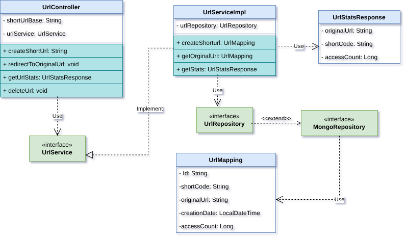
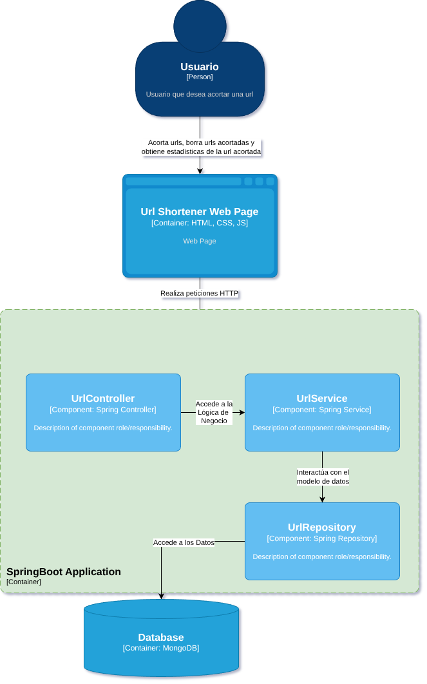
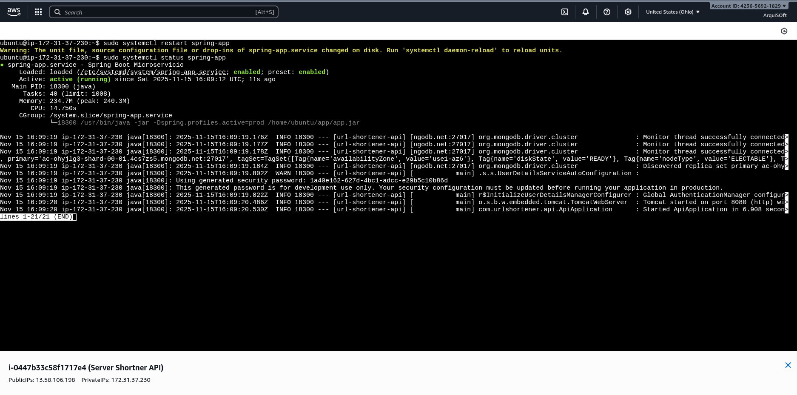

# Punto 1: Modelado y Despliegue Inicial

## 📋 Descripción

Microservicio de acortador de URLs desarrollado con Spring Boot y desplegado en AWS EC2. Permite crear URLs cortas, redirigir a URLs originales y consultar estadísticas de uso.

## 🛠️ Tecnologías Utilizadas

- **Java 21**
- **Spring Boot**
- **Maven**
- **MongoDB Atlas** (Base de datos)
- **AWS EC2** (Infraestructura)

## 📊 Arquitectura

### Diagrama de Clases


### Diagrama de Componentes


## 🚀 Despliegue en EC2

### Especificaciones de la Instancia
- **Tipo:** t3.micro
- **OS:** Ubuntu 22.04 LTS
- **Región:** us-east-2
- **Puerto:** 8080 (redirigido desde 80 con iptables)

### Configuración del Servicio

La aplicación está configurada como servicio systemd:
```bash
# Ver estado
sudo systemctl status spring-app

# Iniciar
sudo systemctl start spring-app

# Reiniciar
sudo systemctl restart spring-app

# Ver logs
sudo journalctl -u spring-app -f
```

## 📡 Endpoints

### Base URL
```
http://13.58.106.198
```

### Endpoints Disponibles

#### POST /api/urls
Crear URL acortada
```json
// Request
{
  "originalUrl": "https://ejemplo.com"
}

// Response
{
  "success": true,
  "data": {
    "shortCode": "abc123",
    "originalUrl": "https://ejemplo.com",
    "createdAt": "2025-11-15T...",
    "clicks": 0
  }
}
```

#### GET /{shortCode}
Redirigir a URL original (incrementa contador)
```
http://13.58.106.198/abc123 → Redirige a https://ejemplo.com
```

#### GET /api/stats/{shortCode}
Obtener estadísticas de una URL
```json
{
  "shortCode": "abc123",
  "originalUrl": "https://ejemplo.com",
  "clicks": 42,
  "createdAt": "2025-11-15T..."
}
```

## 📸 Evidencias



- Aplicación corriendo en EC2
- Endpoints funcionando
- Servicio systemd activo
- Logs de la aplicación

## 🔑 Principios Aplicados

### SOLID
- **Single Responsibility:** Cada clase tiene una responsabilidad única (Controller, Service, Repository)
- **Dependency Inversion:** Las dependencias se inyectan mediante interfaces

### DRY
- Reutilización de código en capa de servicio
- Mapeos centralizados en DTOs

## 📦 Estructura del Proyecto
```
punto-1-microservicio/
├── src/
│   └── main/
│       ├── java/
│       │   └── com/urlshortener/
│       │       ├── controller/
│       │       ├── service/
│       │       ├── repository/
│       │       └── model/
│       └── resources/
│           ├── application.properties
│           └── application-prod.properties
├── screenshots/
├── pom.xml
└── README.md
```

## 👤 Autor

Argenis Medina Morales

## 📅 Fecha

Noviembre 2025
