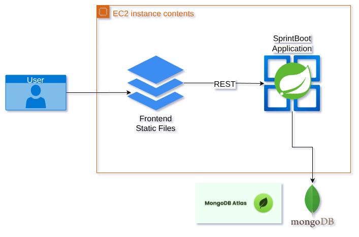
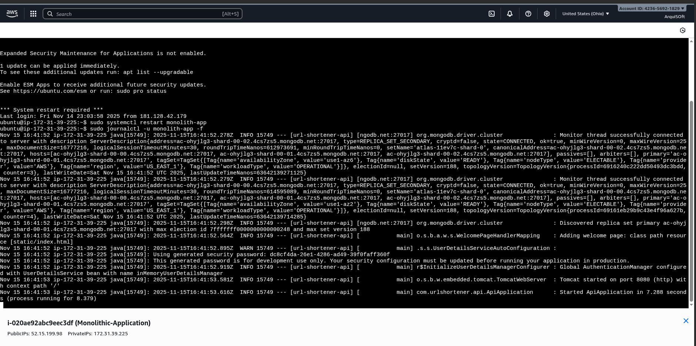
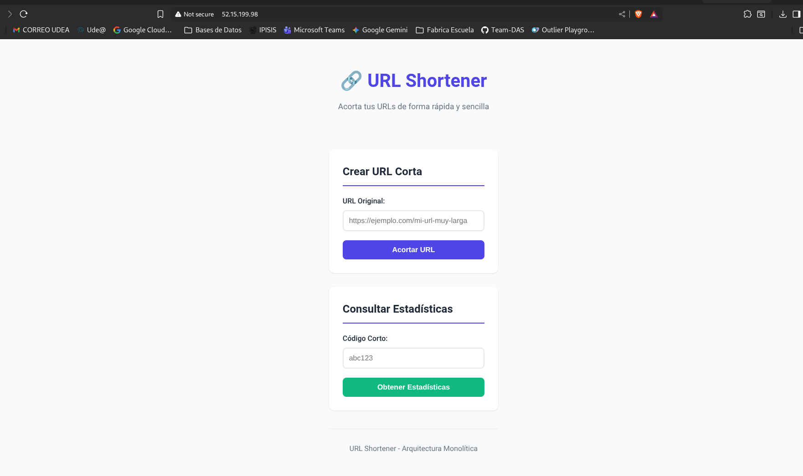

# Punto 2a: Arquitectura Monolítica

## 📋 Descripción

Aplicación monolítica que integra backend (Spring Boot) y frontend (HTML/CSS/JS) en un único servidor EC2. Todo el sistema corre bajo una misma instancia y proceso.

## 🏗️ Arquitectura

### Características
- **Backend y Frontend juntos** en el mismo servidor
- **Despliegue unificado** - Un solo artefacto (.jar)
- **Servidor único** - EC2 ejecutando todo
- Frontend servido desde `src/main/resources/static`

### Diagrama de Arquitectura


## 🛠️ Tecnologías

### Backend
- Spring Boot 
- Java 21
- MongoDB Atlas

### Frontend
- HTML5
- CSS3
- JavaScript (Vanilla)
- Fetch API para comunicación con backend

## 🚀 Despliegue

### Instancia EC2
- **Tipo:** t3.micro
- **OS:** Ubuntu 22.04
- **IP:** 52.15.199.98
- **Puerto:** 80 (redirigido desde 8080)

### Configuración como Servicio
```bash
# Servicio systemd
sudo systemctl status monolith-app
sudo systemctl restart monolith-app

# Ver logs
sudo journalctl -u monolith-app -f
```

## 📡 Endpoints

### Base URL
```
http://52.15.199.98
```

### API Endpoints

Todos los endpoints del backend están bajo `/api/*`:

- `POST /api/urls` - Crear URL corta
- `GET /{code}` - Redirigir a URL original  
- `GET /api/urls/{code}` - Obtener estadísticas

### Frontend

- `/` - Página principal (index.html)
- Frontend y backend comparten el mismo dominio

## 🏃 Ejecutar Localmente

### Compilar
```bash
mvn clean package
```

### Ejecutar
```bash
java -jar target/api-0.0.1-SNAPSHOT.jar --spring.profiles.active=prod
```

Acceder a: `http://localhost:8080`

## 📸 Evidencias

Frontened servido: `http://52.15.199.98/`

#### Servidor Corriendo:



#### Frontend Funcional:




- Aplicación monolítica corriendo
- Frontend funcionando
- API respondiendo
- Todo desde una sola URL

## ⚖️ Ventajas y Desventajas

### ✅ Ventajas
- Despliegue simple
- Desarrollo más rápido
- Menos complejidad operacional
- Sin problemas de CORS
- Menor latencia entre frontend y backend

### ❌ Desventajas
- Escalabilidad limitada
- Punto único de fallo
- Recursos compartidos (CPU/RAM)
- Actualizaciones requieren reiniciar todo
- No aprovecha CDN para frontend

## 📦 Estructura del Proyecto
```
punto-2a-monolitica/
├── src/
│   └── main/
│       ├── java/
│       │   └── [código backend]
│       └── resources/
│           ├── static/          # Frontend
│           │   ├── index.html
│           │   ├── styles.css
│           │   └── app.js
│           └── application.properties
├── screenshots/
├── pom.xml
└── README.md
```

## 👤 Autor

Argenis Medina Morales

## 📅 Fecha

Noviembre 2025