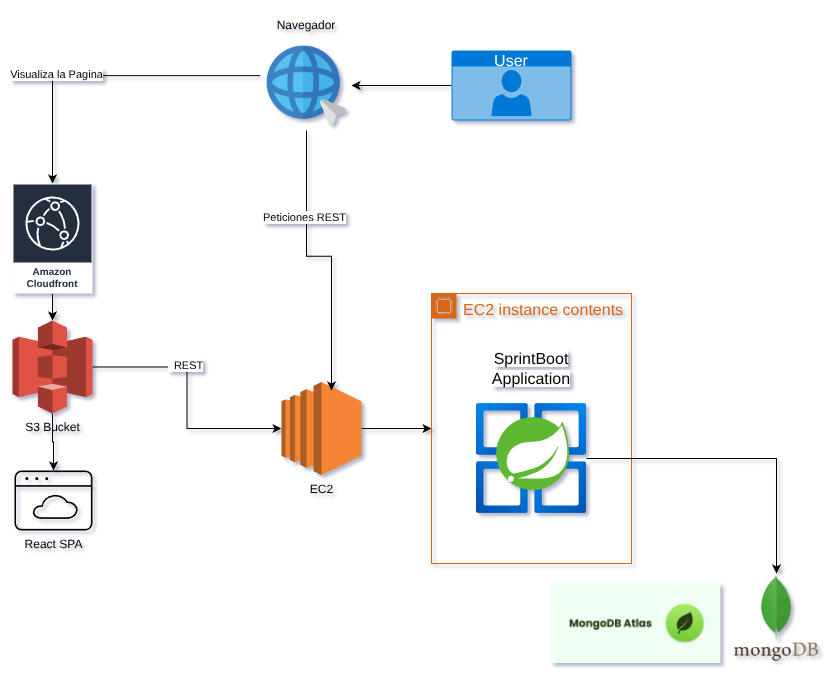
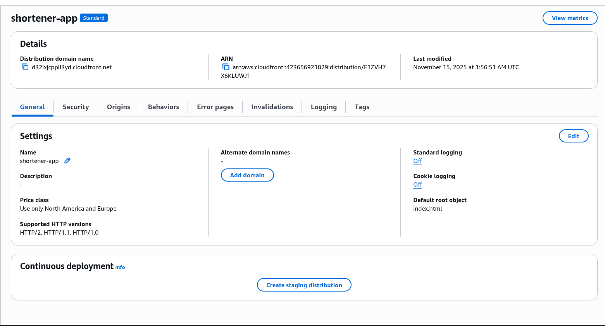
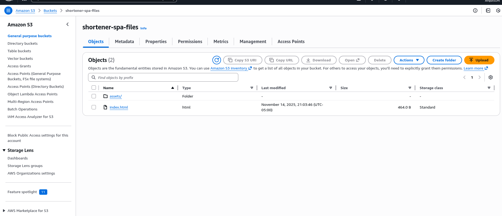
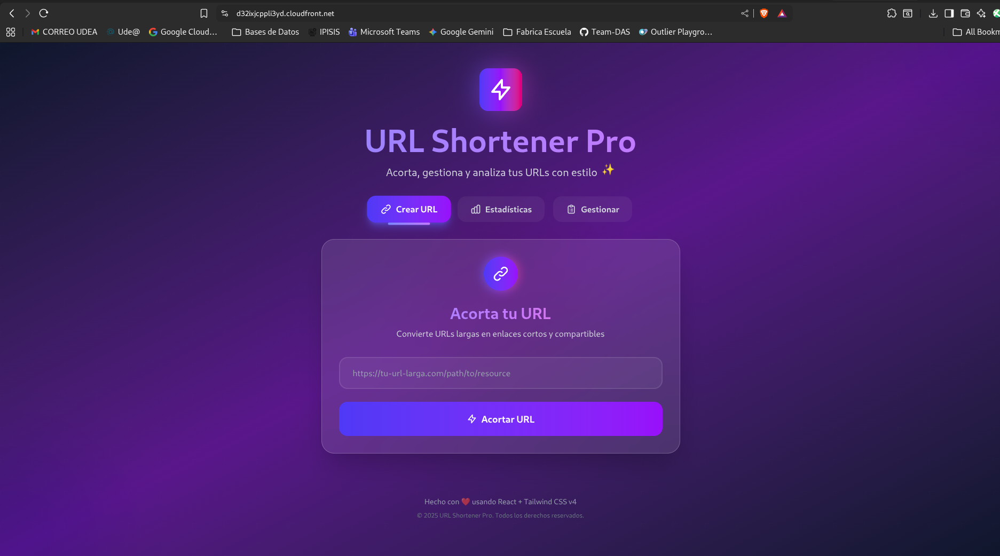

## 📋 Descripción

Arquitectura distribuida que separa frontend y backend en componentes independientes. El frontend (React SPA) se sirve desde S3 + CloudFront, mientras el backend (Spring Boot) corre en EC2. Ambos componentes pueden escalarse y desplegarse de forma independiente.

## 🏗️ Arquitectura

### Características
- **Frontend:** React SPA en S3 con distribución global vía CloudFront
- **Backend:** API REST en Spring Boot sobre EC2
- **Separación física** de componentes
- **Escalabilidad independiente** de cada capa

### Diagrama de Arquitectura


### Flujo de Datos

**Fase 1 - Carga inicial:**
```
Usuario → CloudFront → S3 → Descarga app React al navegador
```

**Fase 2 - Uso de la aplicación:**
```
Navegador (React) → API REST en EC2 → MongoDB Atlas
```

## 🛠️ Tecnologías

### Frontend
- **React 18** con Vite
- **Axios** para llamadas REST
- **S3** para hosting estático
- **CloudFront** como CDN

### Backend
- **Spring Boot**
- **Java 21**
- **EC2** (t3.micro)
- **MongoDB Atlas**

## 🌐 URLs

- **Frontend (CloudFront):** `https://d32ixjcppli3yd.cloudfront.net/`
- **Backend (EC2):** `http://13.58.106.198` (interno, llamado por el frontend)


## 🔧 Configuración


### CloudFront Behaviors

| Path Pattern | Origin | Descripción |
|--------------|--------|-------------|
| `Default (*)` | S3 | Archivos estáticos del frontend |
| `/api/*` | EC2 | Proxy a backend API |

Esto evita problemas de CORS y mixed content.


## 📈 Ventajas de la Arquitectura Distribuida

### ✅ Escalabilidad
- Frontend escala automáticamente (S3 + CloudFront)
- Backend puede escalar horizontalmente (múltiples EC2)
- Cada componente escala según su carga

### ✅ Performance
- **CDN global:** Frontend servido desde edge locations cercanas al usuario
- **Caché inteligente:** CloudFront cachea assets estáticos
- **Menor carga en backend:** EC2 solo maneja API

### ✅ Resiliencia
- Si backend cae, frontend sigue disponible (con mensaje de error)
- Despliegues independientes sin downtime total

### ✅ Costos optimizados
- S3: paga solo por almacenamiento y transferencia real
- CloudFront: caché reduce requests a origin
- Backend: puede usar instancias más pequeñas

## ⚠️ Desventajas

### ❌ Complejidad
- Más componentes que gestionar
- Configuración de CORS/proxy necesaria
- Deploy más complejo (2 pipelines)

### ❌ Latencia API
- Llamadas REST atraviesan internet público
- Sin CDN, cada request va directo a EC2

### ❌ Debugging
- Errores pueden estar en frontend, backend o comunicación
- Logs distribuidos en múltiples servicios


## 📦 Estructura del Proyecto
```
punto-2b-distribuida/
├── frontend-s3/              # React SPA
│   ├── src/
│   ├── public/
│   ├── package.json
│   ├── .env.production
│   └── vite.config.js
├── backend/                  # (Referencia al punto-1)
├── screenshots/
│   ├── 01-cloudfront-url.png
│   ├── 02-s3-bucket.png
│   ├── 03-cloudfront-behaviors.png
│   └── 04-app-funcionando.png
└── README.md
```

## 📸 Evidencias

#### EC2 Instancia Corriendo:


#### Cloudfront Distribución


#### Bucket S3 Static Files


#### Frontend Servido via CloudFront


- CloudFront distribution activa
- S3 bucket con archivos
- Frontend funcionando desde CloudFront
- Llamadas API exitosas
- CloudFront Behaviors configurados

## 🔐 Seguridad

- **S3:** Bucket policy permite solo lectura desde CloudFront (OAC)
- **Backend:** CORS configurado para dominio CloudFront
- **CloudFront:** HTTPS obligatorio

## 👤 Autor

Argenis Medina Morales

## 📅 Fecha

Noviembre 2025